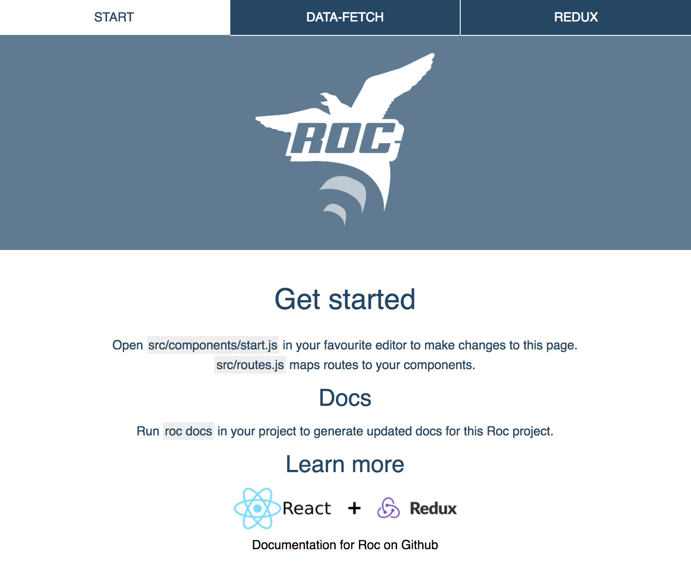

# Getting started with Roc

We will be focused on React and Redux based applications in this starter-guide. A very popular choice combined with server-rendering for delivering blazing fast user experiences. Roc has taken care of all the tooling so that you can get started writing your app instantly.  

Keep in mind that Roc is **not** tied to React and Redux extensions. Creating your own extension is also an option.

## Install Roc
Make sure you have [Node.js](https://nodejs.org) 4.x or higher and [npm](https://www.npmjs.com/) 3.x or higher on your system.

__Currently with official support for Mac, Linux and Windows.__

```
npm install -g roc@next
```
`roc` will now be available globally on your system.

## Create new Redux and React project
Create directory for your app:
```
mkdir react-app && cd react-app
```
Bootstrap app starting point:
```
roc init web-app-react wip
```
We recommend you answer `Yes` to data-fetching, Redux and Jest testing when prompted, unless you have a clear strategy on how to implement this on your own. You can delete them later in your project if you wish.

Install project modules:
```
npm i
```

## Launch project and start coding: development mode
```
roc dev
```
While this command is running the following is at your disposal:
- See your app running at http://localhost:3030 with Browsersync support.
- Manage your BrowserSync instance at http://localhost:3031. Connect as many different devices as you like.
- Live reloading is active, and code can be live-edited and will be live-pushed to your browser.

Your React app is fully universal, and if you opted in for data-fetching or Redux you will also have working demos of the most common use-cases in frontend oriented apps accessible in the menu: 



## View (dynamic) configuration options
```
roc dev --help
```

This prints all options that you can use to configure your current Roc application. They are defined by the extensions that we use; currently `roc-package-web-app-react` in this guide. The runtime `cli` parameters are compatible with `roc.config.js`. We recommend the use of `roc.config.js` for configuration that should be persisted in your project.

## Default project structure
The basic template defined this for you upon `init`. Below is a summary of the __entire__ tree with all the optionals like data-fetching and redux included.

```
├── public
│   └── favicon.png
├── src
│   ├── components
│   │   ├── clicker
│   │   │   ├── index.js
│   │   │   └── style.scss
│   │   ├── fetching
│   │   │   ├── index.js
│   │   │   └── style.scss
│   │   ├── header
│   │   │   ├── index.js
│   │   │   ├── roc.png
│   │   │   └── style.scss
│   │   ├── redux
│   │   │   ├── index.js
│   │   │   └── style.scss
│   │   ├── start
│   │   │   ├── ext.png
│   │   │   ├── index.js
│   │   │   └── style.scss
│   │   ├── index.js
│   │   ├── reset.scss
│   │   └── style.scss
│   ├── redux
│   │   ├── clicker.js
│   │   ├── reducers.js
│   │   └── repo.js
│   └── routes.js
├── package.json
└── roc.config.js
```

`app/components` - components of the application  
`app/screens` - components mapped to routes  
`app/redux` - source related to data flow  
`app/routes` - react router mapping  
`public` - files served directly from web server  
`roc.config.js` - application configuration  
`package.json` - `npm` package data

You may wish your project to use an entirely different structure, and this can be done  using `roc.config.js` and specifying alternative paths for `reducers`, `routes`, etc.

## Default project configuration
This configuration is the default one generated by [`roc-template-web-app-react`](https://github.com/rocjs/roc-template-web-app-react).
```
module.exports = {
  settings: {
    runtime: {
      applicationName: '{{ title }}',
      port: {{ port }},
      serve: ['public', 'build/client'],
      favicon: 'favicon.png',
    },
    build: {
      reducers: 'src/redux/reducers.js',
      routes: 'src/routes.js',
    },
  },
};
```


## Change application configuration
Permanent configurations belonging to your application should be defined in `roc.config.js`.

Temporary configuration changes can be done using the `cli` as seen from `roc dev --help`.

## Run tests
If you opted in to include Jest, you can run the included demonstration test.

```
roc test
```

## Build production bundles
```
roc build
```

Be sure to run this to make a production-ready bundle of your application. Typically done as a part of building your Docker image.

## Start production bundles
```
roc start
```

Your app is now ready to serve real traffic.  

These common tasks are also aliased as npmscripts for your convenience; `npm start`, `npm test`, `npm run dev`, `npm run build`, `npm run lint`.

# FAQ
## What does roc init do?
`roc init` initializes new projects for you.  

`web-app-react` (the first argument used in this guide) is an alias to `rocjs/roc-template-web-app-react`, a [repository location](https://github.com/rocjs/roc-template-web-app-react) on Github. This defines the initial project setup.  

We also specify `wip`, which is a branch that contains the latest features. The initialized app is then set up to use the [roc-package-web-app-react](https://github.com/rocjs/roc-package-web-app-react) extension automatically. You can think of this as an optimized set of tools and libraries that aims to keep your project code simple and clean.

### What if I am not happy with the result of init?
You _can_ use your own template repository by running `roc init GITHUB_USER/REPO`.  
You _can_ also create your own extensions from scratch.

Think of Roc as a complete and fully open source JavaScript framework provider and library composer.

## Do I have to use sass and CSS modules?
We really like this and provide it  by default. However you are free to make other choices; we currently supply plugins for `less` and  `css+postss` as well.

## Why does Roc ecosystem currently use Webpack 1.x and Koa 1.x?
Stability and productivity is the most important. However a dependency-update __is__ coming, and the good part is that it will require little effort from you to upgrade as a Roc user when it is available!

## Can I run Roc web-app-react apps in Docker?
Yes, this works great. Here is an example `Dockerfile`

```dockerfile
FROM node:7.10.0
RUN mkdir -p /usr/src/app
WORKDIR /usr/src/app
COPY package.json /usr/src/app/package.json
RUN npm install
COPY . /usr/src/app
RUN npm run build
CMD ["npm", "start"]
EXPOSE 3000
```

## I am a bit stuck, where can I find more information?
Roc with `roc-package-web-app-react` installs and manages many libraries for you so that you can focus on your application. Below is a link outlining the most important libraries you should be familiar with when using `roc-package-web-app-react`. They are provided to you automatically, and Roc does not modify their API.

- [Browsersync](https://browsersync.io)
- [Redux](https://github.com/rackt/redux)
- [React](https://facebook.github.io/react/)
- [React Router](https://github.com/rackt/react-router)
- [React Helmet](https://github.com/nfl/react-helmet)
- [CSS Modules](https://github.com/css-modules/css-modules)

We also recommend getting an understand of how Roc works on a general level. Reading the [documentation](https://github.com/rocjs/roc/tree/master/docs#table-of-contents) will get you started and provide an overview before you start reading the code.